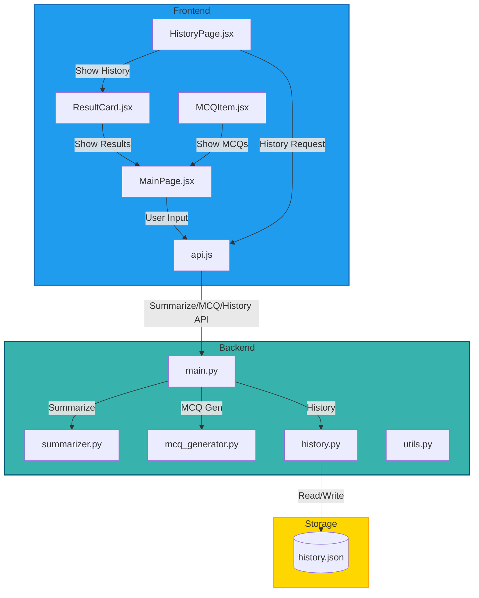

# Smart Summary Quiz

<div align="center">
  
  
  <h3>AI-Powered Content Summarization & Quiz Generation</h3>
  
  <p>
    <a href="#features">Features</a> •
    <a href="#quick-start">Quick Start</a> •
    <a href="#api-reference">API</a> •
    <a href="#contributing">Contributing</a>
  </p>
  
  <p>
    
    
    
    
    
    
  </p>
</div>

---

## 🚀 Overview

**Smart Summary Quiz** is an AI-powered web app that transforms any text, document, or article into concise summaries and interactive quizzes. Upload files, paste text, or enter URLs—get instant summaries and test your knowledge with MCQs!

---

## 🏗️ Architecture

### 🟦 System Flow (Colorful Mermaid Table)



---

## 📁 Project Structure

```
smart-summary-quiz/
│
├── backend/
│   ├── main.py
│   ├── summarizer.py
│   ├── mcq_generator.py
│   ├── history.py
│   ├── utils.py
│   ├── history.json
│   └── requirements.txt
│
├── frontend/
│   ├── src/
│   │   ├── pages/
│   │   │   ├── MainPage.jsx
│   │   │   └── HistoryPage.jsx
│   │   ├── components/
│   │   │   ├── ResultCard.jsx
│   │   │   ├── MCQItem.jsx
│   │   │   ├── FileUpload.jsx
│   │   │   ├── InputTabs.jsx
│   │   │   └── ProgressBar.jsx
│   │   ├── services/
│   │   │   └── api.js
│   │   ├── App.jsx
│   │   └── main.jsx
│   ├── index.html
│   ├── App.css
│   └── vite.config.js
│
├── README.md
└── LICENSE
```

---

## 🛠️ Setup & Run

### Backend (FastAPI)
```bash
cd backend
python -m venv venv
source venv/bin/activate
pip install -r requirements.txt
uvicorn main:app --reload
```

### Frontend (React + Vite)
```bash
cd frontend
npm install
npm run dev
```

---

## 🌐 API Endpoints

### Summarization
- `POST /api/summarize`
  - Request: `{ "text": "..." }`
  - Response: `{ "summary": "..." }`

### MCQ Generation
- `POST /api/mcqs`
  - Request: `{ "text": "..." }`
  - Response: `{ "mcqs": [ ... ] }`

### History
- `GET /api/history/`
  - Response: `[ { summary, mcqs, userAnswers, score, ... } ]`
- `POST /api/history/`
  - Request: `{ summary, mcqs, ... }`
- `POST /api/history/response/{idx}`
  - Request: `[userAnswers]`
  - Response: `{ success, score }`

---

## 🎨 UI/UX Highlights

- **Modern, animated 3D gradient backgrounds**
- **Brand colors:** #209CEE (primary), #176bb3 (hover), #E6F4FB (light)
- **Responsive design:** Works on desktop and mobile
- **Interactive quizzes:** Submit answers, see instant feedback and score
- **History:** View all past summaries and quizzes, review your answers

---

## 🧰 Tech Stack

- **Frontend:** React, Vite, TailwindCSS
- **Backend:** FastAPI, Transformers, NLTK, spaCy, PyPDF2, python-docx, BeautifulSoup
- **Storage:** JSON file (can be upgraded to a database)
- **APIs:** HuggingFace Transformers, Google Search API

---

## 🤝 Contributing

1. Fork the repo
2. Create your feature branch (`git checkout -b feature/your-feature`)
3. Commit your changes (`git commit -am 'Add feature'`)
4. Push to the branch (`git push origin feature/your-feature`)
5. Open a Pull Request

---

## 📄 License

This project is licensed under the MIT License. See [`LICENSE`](LICENSE) for details.

---

## 👤 Author

**Arijit Mondal**  
[GitHub](https://github.com/arijitmondal)  
Email: arijitmondal@example.com

---

> *Smart Summary Quiz: AI-powered learning for everyone!*